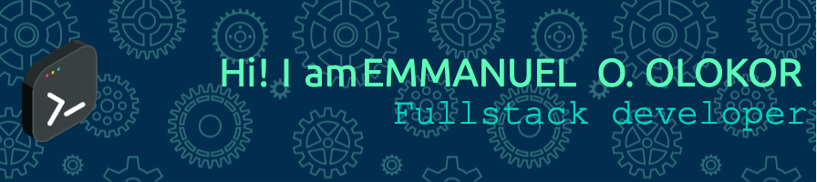

<h3 align="center">A Passionate MERN Stack Developer</h3>

  

- 🔭 I’m currently working on **An E-Commerce application**

- 👯 I’m looking to collaborate on **MERN Projects**

- 👨‍💻 All of my projects are available at [https://github.com/Nixhazel](https://github.com/Nixhazel)

- 💬 Ask me about **My Projects**

- 📫 How to reach me **neolokor1@gmail.com**

- 📱 Currently working on React Native Projects 

<h3 align="left">Connect with me:</h3>

<h3 align="left">Languages and Tools:</h3>

               

  

- 
Welcome to my GitHub profile! I am a professional software engineer with experience in a wide range of programming languages and technologies. 

My primary expertise lies in developing full stack web applications using technologies such as JavaScript, Node.js, and React.  

On my GitHub profile, you will find a variety of personal projects and contributions to open-source projects that showcase my skills and experience. I always strive to write clean, maintainable, and well-documented code, and I am always looking for ways to improve my skills and knowledge. 

In addition to my technical skills, I am also a strong collaborator and communicator. I have experience working in both Agile and Scrum environments and I am comfortable working in a team or individually.

I am excited about the opportunity to apply my skills and experience to new and challenging projects, and I am always open to new opportunities. Please feel free to contact me if you would like to discuss a project or if you have any questions.

Thank you for visiting my GitHub profile and I look forward to connecting with you!

